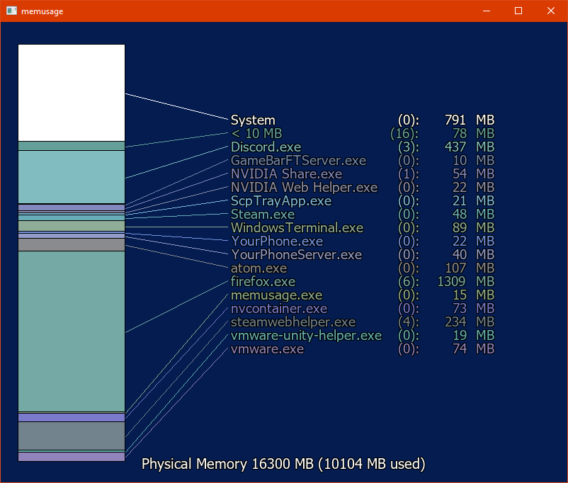

# memusage

*gmemusage* was a tool featued on Silicon Graphic's IRIX operating system. It showed a breakdown of physical memory that was in use by processes on the system. A screenshot is below.

 

I've recreated a few IRIX tools ([Twilight](https://github.com/bcaluneo/Twilight) and [osview](https://github.com/bcaluneo/osview)) to work on Windows and this was next in line so here's a screenshot:

 
The numbers reported here are the "Working Set". Under the "Processes" tab in Windows Task Manager the numbers reported there are a little different, the number there is the "active private working set". The "Details" tab will show the same number as reported here, but in kilobytes instead of megabytes. The difference is that the former is all the memory currently in use and the latter is the memory in use that cannot be shared with another process. Default poll time is 1000ms. Processes that use less than 50 MB are grouped together. The number in parentheses next to the name of a process is the number of subprocesses.

## Building

A precompiled binary is provided under the release section, but if you wish to build yourself:

#### Dependencies
* SDL2 (& SDL2 image/ttf)
* Win32
* make
* C++ compiler, default is gcc

The makefile does require you to configure the library and include directories for SDL2. This project also uses NFont to speed up font rendering. This is a wonderful program and I use it was standard with SDL. The host repository can be found [here](https://github.com/grimfang4/nfont).
